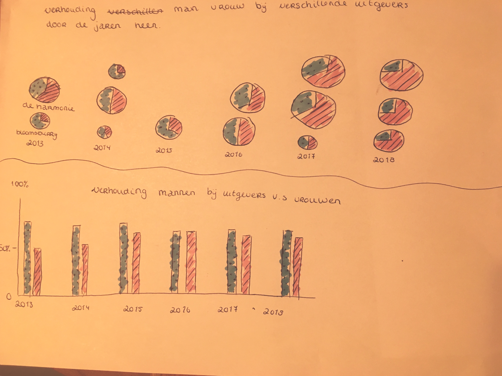

# Functional Programming
## Partner: Oba 
**In this project we got to build a research case with data from the Oba. By talking to an Api and in the end making a data visualization with D3. All this while programming as functional as possible. Bye spaghetti code!**

## Table of Contents
* [Visualization](#visualization) 
* [Research](#research)
* [Learning proces](#learning-proces)
* [Credits](#credits)
* [Resources](#resources)

## Visualization

End result is hosted on [github pages](https://chelseadoeleman.github.io/functional-programming/)

## Research

### Oriëntation

By talking to the Api I have looked at the different variables in the data and what could be interesting starting points. Unfortunately, the Api was quite complicated, but thanks to [Daniël van de Velde's ReadMe](https://github.com/DanielvandeVelde/functional-programming/blob/master/README.md) I was able to get a good overview of the data and then to draw up research questions.

### Research Questions

These are some questions I think are interesting to look further into, while looking at the dataset of the Oba.

* How has the relationship between male and female authors in terms of publication changed over the years?
    * Is there a difference between publishers in the library who publish more work by male authors than female authors?
    * Have there been publishers in the library who have started to publish more work by female authors and publishers who are still representing more male authors through the years?
    * Does the Oba have more female than male authors in their catalogue and is this because of the number of publishers in the Oba?
    * Back in time when the feminist wave came into being, were there more books published by women or more books about feminism itself?

* Are there more books published by specific publishers in certain years and how is this related to events in that period?
    * Do publishers publish more books of a certain genre and is this related to certain events?

* Have more technology books or magazines been published in the last five years and are they using more cover images for those books?
    * Are more and more cover images used over the years and is there a connection between them and the publishers?

* How many books are translated against books that are kept in the original language, is there a connection to the publishers?

* Are books by a particular author more often in a specific location than other locations and is this related to the year of publication?
    * Are these books also sorted by gender?

I would like to focus on the difference between male and female authors in publishers and how this has changed over the years. My expectations are that more male authors are still represented by publishers, but that there is an ascending trend among female authors. 

If there is more time after realising my data in a graph, in addition I also think it would be interesting to find out which publishers publish more young-adult books and whether this genre is generally written more by female authors than by male authors. But isn't relevant for now, maybe somewhere in the future.

**Main question**

What will the difference between male and female authors look like over the past few years? 

**Hypothesis**

Over the past thirty years, the number of female authors has increased significantly among publications, although the number still does not exceed the number of male authors.

### Data

For this research I need the following data from the Api:
    * Only the data about books in the library
    * The different authors
    * The different publishers
    * The books over the past thirty years and the year of publication.

Additional sources:
    * Overview of names of all female and male authors, where the gender is also known.

### Possible visualizations

These are some sketches I made beforehand. So browsing through Observable and bl.ocks would be easier, because I would know what to look for. It also gave me an overview of what I might be able to realise in the amount of time that I had and with my Javascript skills. The first sketch required some merging of two different graphs, which would make reading the data harder than it should be and also more difficult to realise with D3. Which is a complex program in itself.

## Learning proces

I made some major steps throughout this project. 
First of all working with an Api was something I had never done before, so setting it up was enlightning and frustrating at the same time. I learned how to work with different parameters in the Api while using facets, etc. and to gather data from the Api neatly with Promises. Promises where always something I could not wrap my head around, until now. I finally get the gist of it. 

Then came along all the functions, because it is still functional programming. In the end the best way for me to code, was to directly write stept by step, what needed to happen to realise that certain part. Then to write it like spaghetti code and in the end dividing it into different functions, which I then wrote in [helpers](./helpers.js). From there I could call the different functions that were defined in helpers in my [index.js](./index.js) so my index.js wouldn't blow up with all the different functions.

Another thing I learned was to load data dynamically in a new JSON file, but moreover just creating new Objects with data from the Api. So that the data could be more clearly arranged and I could get a better overview. I found this the most difficult part of functional programming, but in the end I managed but with a lot of help. 
I really liked the different functions that made it possible to do all kind of things with an array, like map and filter. I still find it quite hard though to clean up the data and definitely want to keep practicing this!

Because I was so engrossed in the data and had a lot of difficulties with it, I didn't allow enough time to work and experiment with D3. It looks so cool, so I definitely want to dive deeper into D3! Also because it is quite complex en the possibilities are almost endless! There is still a lot to learn and I got the feeling that I am not at the right level now, where I should have been by the end of this course. I find this very unfortunate and a real pity.

A complete log of my learning proces can be found [here!](./proceslog.md)

## Credits

These are the people that helped me the most while programming. Either by asking questions and/or looking at their repository's.

* [Folkert-Jan](https://github.com/FJvdPol) & Dennis
* [Daniël van de Velde](https://github.com/DanielvandeVelde)
* [Wouter](https://github.com/maanlamp)
* [Maikel](https://github.com/Maikxx)
* Tim
* [Jessie](https://github.com/jessiemasonx)
* [Linda](https://github.com/LindadeHaan)

## Resources

* [Oba Api](https://zoeken.oba.nl/api/v1/)
* Stackoverflow
* MDN web tools
* [Grouped bar chart](https://bl.ocks.org/bricedev/0d95074b6d83a77dc3ad)
* [Tooltips](http://bl.ocks.org/d3noob/a22c42db65eb00d4e369)